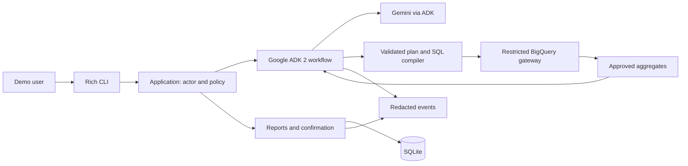
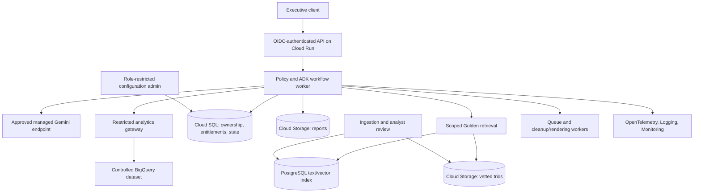

# Proposed architecture

**Status: design proposal. The application is not implemented, live integrations are unverified, and no deployment is claimed.**

The assistant will translate retail questions into bounded analyses and explain computed results. Gemini proposes plans and wording; Python enforces permissions, privacy, budgets and report operations. The proposed stack is Google ADK 2, Gemini, BigQuery, SQLite and Rich. ADK provides explicit graph workflows combining Python functions and model-driven steps, fitting the assignment's Google services. The selected package baseline is `google-adk==2.11.0`; installation and integration remain to be tested. [ADK graph workflows](https://adk.dev/graphs/), [released package](https://pypi.org/project/google-adk/2.11.0/).

## Prototype scope

The prototype will implement safe analysis, owned-report confirmation, resilience and observability in a local CLI. Evaluation will check these behaviors. Golden retrieval, preference learning and persona administration remain HLD-only, alongside production authentication, hosting and future tools. Session context supports follow-ups without claiming preference learning.

BigQuery will query configured tables in `bigquery-public-data.thelook_ecommerce`. Verify schemas, joins, location and usable dates before execution. SQLite holds sanitized conversation metadata, report ownership and pending confirmations; Rich handles presentation. Map ADK sessions to trusted actor/conversation identities and validate the chosen session adapter during implementation. Application policy controls access to both stores.

## Analysis workflow

Route requests to analysis, clarification, report actions or refusal. Gemini produces a typed `AnalysisPlan`: metrics, dimensions, dates, filters and dependent operations. Python validates it against the catalog, actor entitlements and budget, then dynamically compiles parameterized SQL. Table identifiers, expressions and joins come from trusted code. [BigQuery parameters](https://docs.cloud.google.com/bigquery/docs/parameterized-queries).

The operation catalog should compose aggregates, comparisons and contribution breakdowns. For a spending comparison between states, compute scoped revenue, purchasing-customer count, order frequency, basket value and product mix before explanation.

This restricts expressiveness compared with unrestricted model SQL, but makes calculations and authorization auditable. Unsupported operations require clarification or a limitation; there is no raw-SQL fallback. **Acceptance requires a genuine multi-step comparison and follow-up, not fixed prompt-to-query mappings.** Expand the catalog if it cannot express the agreed evaluation questions.

Use a configurable Gemini model through ADK and expose custom analysis tools with typed contracts. Each tool rechecks actor scope, validates the plan and enforces budgets before calling the gateway. The workflow exposes only these guarded operations. Bound every correction cycle and model-driven step explicitly; graph routing alone does not impose a retry or cost limit. [ADK graph workflows](https://adk.dev/graphs/), [graph routes](https://adk.dev/graphs/routes/).

## Safety and PII

Resolve product entitlements from trusted storage, never prompts. Apply scope before aggregation and preserve it through every join. Mixed-product order totals must not include unauthorized items. Scope report searches, sessions and future retrieval/cache entries too.

Return approved aggregates and coarse dimensions. Names, emails, addresses, exact locations and raw customer identifiers must not reach model context or output. Internal IDs may support distinct counts. Intake redaction, minimum-group suppression and output validation add protection; repeated-query inference needs further production controls.

Customer ranking introduces a separate tradeoff: session-specific pseudonymous labels avoid showing identities but remain linkable and potentially identifying. Aggregate segment rankings are the safer default. Any individual ranking needs an explicit privacy decision and evaluation; pseudonymization does not make it anonymous.

A selectable local actor demonstrates authorization rules, not authentication. Shared BigQuery credentials identify the backend principal, not the executive. Production needs restricted analytics views/columns and a reviewed identity-to-policy design. [BigQuery row security](https://docs.cloud.google.com/bigquery/docs/row-level-security-intro).

## Report deletion boundary

Store owner, conversation, content, evidence references and version. Support owned-report selection by literal mention or current conversation. Resolve ambiguity before preview.

Preview exact titles/count and freeze IDs/versions in an expiring pending operation. Require a distinct confirmation identifier through the CLI, outside model control. Recheck actor, ownership, versions, expiry and unused state transactionally; delete only those targets and consume confirmation atomically. Changed targets require a new preview. New reports created after preview survive. Cancel, expiry and no-match leave reports unchanged; replay returns the recorded outcome. Audit metadata must not retain deleted content.

Keep this approval transaction in an application service independent of ADK session state. ADK 2.11.0 adds workflow tool confirmation, while its confirmation documentation still describes experimental support and session-service limitations. Native confirmation can be evaluated later without changing the report-ownership boundary. [ADK 2.11.0 release notes](https://github.com/google/adk-python/releases/tag/v2.11.0), [confirmation documentation](https://adk.dev/tools-custom/confirmation/).

## Grounding and definitions

Define statuses, returns, currency, dates and denominators in the metric catalog. Spend per customer must state whether it covers purchasing customers within permitted products. Inactivity-based churn is a proposed proxy requiring a cohort, threshold and sufficient observation window.

Report observed contributions separately from hypotheses. Transactional associations do not establish causation. Empty results never justify silently changing dates or permissions. Show explicit periods, scope, evidence and limitations.

## Candidate production HLD

GCP is proposed because the source is BigQuery and the model family is Gemini. It is not deployed. Provider interfaces preserve alternatives.

Cloud SQL provides transactional ownership and configuration; Cloud Storage holds artifacts. Scoped service identities and Secret Manager govern credentials. Verify the managed model endpoint, residency, retention, backup/restore and availability requirements before deployment.

### Hybrid intelligence

Version trios with question, SQL, report, schema/metric versions, scope and reviewer provenance. Ingestion removes sensitive details and publishes reviewed records. At query time, filter by permissions and compatibility, then combine text/vector relevance. Supply relevant methodology with source IDs, treating retrieved text as evidence rather than instructions. Revalidate historical SQL through current policy. Analyst-approved corrections update the index and trigger regression evaluation.

### Continuous improvement and persona management

Store per-user presentation preferences separately from policy; explicit choices override inference and users can reset them. System feedback enters a redacted review queue. Changes to knowledge, metrics or prompts require evaluation, approval and rollback.

A nondeveloper admin interface publishes versioned tone/format settings without redeployment. Preview changes against fixed examples; pin the version per request. Security rules and tool permissions remain outside editable persona text.

### Resilience and cost

Start with configurable caps: three planned data operations, one correction cycle and a request deadline. Bound transient retries separately. Dry-run queries, enforce `maximum_bytes_billed` plus a cumulative turn budget, and track actual statistics; `LIMIT` is not a general scan-cost control. [BigQuery cost guidance](https://docs.cloud.google.com/bigquery/docs/best-practices-costs).

Detect invalid plans, syntax/schema errors and empty results; attempt one equivalent correction without changing scope. Compiler defects require code repair. Permission/budget failures stop safely. Reconcile uncertain jobs by ID; report deletion succeeds only after commit. Production adds circuit breakers and background workers.

### Observability and quality assurance

Link message, request, workflow stage, query/job and report/operation IDs. Track latency, outcomes, repairs, refusals, tokens, bytes and dependency failures. Default logs exclude raw prompts, source rows and report bodies. Restricted diagnostics retain sanitized plan/query provenance for reproduction.

Use known-answer fixtures for arithmetic and authorization, adversarial cases for privacy/confirmation, and human review for intent and clarity. Gate release on passing supported analytical cases and no known safety failures in the suite. UX sessions assess comprehension, clarification and deletion recovery. Establish performance targets after measurement; a passing suite is not universal safety proof.

Future tools declare permissions, typed contracts, budgets and side-effect policy. Charts consume validated aggregates; email requires recipient/report checks; web evidence remains untrusted.
